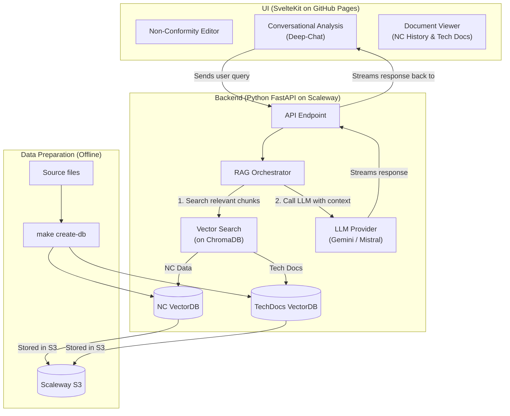

# NC Fullstack - Non-Conformity Analysis Assistant

This project is a full-stack application designed to assist in the analysis and resolution of non-conformities. It leverages a SvelteKit frontend, a Python FastAPI backend, and a RAG (Retrieval-Augmented Generation) pipeline with modern LLMs.

The UI is deployed on [GitHub Pages](https://antoinefa.github.io/nc-fullstack/) and the API is deployed on [Scaleway Serverless Containers](https://nc-api.genai-cgi.com).

## Architecture

The architecture is designed to be scalable and modular, separating the frontend, backend, and data preparation processes.



### Key Components

-   **Frontend**: A [SvelteKit](https://kit.svelte.dev/) application provides a rich user interface for editing non-conformities, chatting with an AI assistant, and viewing relevant documents. It is deployed statically on GitHub Pages.
-   **Backend**: A [FastAPI](https://fastapi.tiangolo.com/) Python application serves the API. It orchestrates the RAG pipeline, calling on vector databases and LLMs to generate intelligent responses. It's deployed as a serverless container on Scaleway.
-   **Data Preparation**: An offline process, managed via the `Makefile`, to prepare the data. It converts source files (like CSVs) into ChromaDB vector stores and uploads them to a Scaleway S3 bucket. This data is then baked into the API's Docker image at build time.
-   **LLM Providers**: The system is designed to be model-agnostic, currently supporting providers like Gemini and Mistral.

## Development

This project uses `make` to streamline development tasks.

1.  **Setup environment**:
    Create a `.env` file from the template and generate a JWT secret.
    ```bash
    make env
    ```

2.  **Start development servers**:
    This will start the UI and API services with hot-reloading.
    ```bash
    make dev
    ```

3.  **Prepare data**:
    If you need to regenerate the vector databases from source files:
    ```bash
    make create-db
    ```

## Deployment

Deployment is automated via GitHub Actions.

-   **API**: When changes are pushed to the `master` branch in the `api/` or `dataprep/` directories, the API Docker image is built and pushed to the Scaleway registry. A new container is then deployed on Scaleway Serverless.
-   **UI**: When changes are pushed to the `ui/` directory, the SvelteKit application is built and deployed to GitHub Pages.
